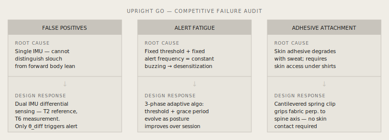
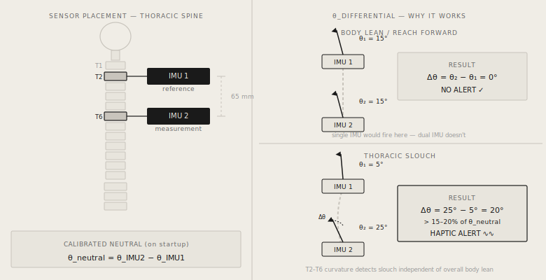
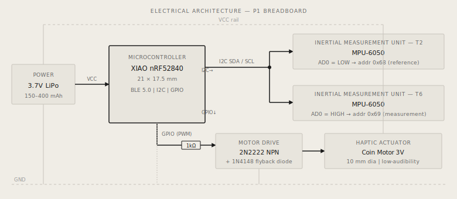

# Posture Clip — Dual-IMU Wearable Biofeedback Device

Consumer posture wearable built from first principles: differential IMU sensing at the T2–T6 thoracic interval to eliminate the false-positive problem that gets every competing device abandoned, plus a 3-phase adaptive haptic algorithm against alert fatigue — in a 75×22×12 mm clip-on package.

**Role:** Solo — sensing architecture, firmware, mechanical packaging
**Status:** Prototype 1 — in active development
**Stack:** Seeed XIAO nRF52840, 2× MPU-6050, Embedded C++, I2C, SolidWorks, FDM

> **Scope note:** breadboard-validated at P1; differential-sensing performance is designed but not yet characterized with logged sensor data.

## Why every posture wearable fails



| Failure mode | Root cause | My design response |
|---|---|---|
| False positives | Single IMU can't distinguish a slouch from a whole-body lean | **Dual-IMU differential sensing** — T2 reference + T6 measurement; only relative angular change alerts |
| Alert fatigue | Fixed threshold + fixed frequency = constant buzzing for exactly the users who need it | **3-phase adaptive algorithm** — sensitivity and grace period evolve with posture improvement |
| Adhesive attachment | ~10 uses, sweat-degraded, needs skin access | **Cantilevered spring clip** — grips fabric, works over a dress shirt |

## Sensing architecture



A single IMU measures absolute tilt — a slouch and a forward lean look identical. Two IMUs disambiguate:

```
θ_differential = θ_IMU2(pitch) − θ_IMU1(pitch)
```

65 mm center-to-center spacing maps to the T2–T6 spinous-process interval where kyphotic curvature is most pronounced. On startup the device stores a calibrated neutral; a 15–20% deviation triggers the haptic motor — personalized to the user's own anatomy. Because detection is thresholded on *change from calibrated neutral*, inter-user anatomical variation and small placement errors shift the baseline, not the signal.

## Electrical architecture



- Two MPU-6050s on one I2C bus (AD0 → 0x68 / 0x69)
- **nRF52840 over ESP32** on power grounds: BLE at a fraction of the current draw on a 150–400 mAh LiPo
- 2N2222 + 1N4148 flyback for the 10 mm coin motor (GPIO can't source motor current)
- Estimated P1 power budget: ~10 mA average → ~15–40 h per charge; P2 targets <2 mA via MPU-6050 cycle mode and BLE interval tuning

## 3-phase adaptive haptic algorithm

Continuous alerts cause desensitization — the same failure mode documented in ICU alarm research. The algorithm's critical parameter is the **grace period**, not the threshold:

1. **Phase 1** — tight threshold, 10 s grace: builds awareness
2. **Phase 2** — threshold widens, 20–30 s grace: alerts reduce as posture improves
3. **Phase 3** — long grace, infrequent reminders: safety net, not trainer

Gestures: single tap pauses 10 min, double tap recalibrates, 3 s hold powers on/off.

## Enclosure & DFM

75×22×12 mm envelope set by the IMU spacing, PCB footprint, and disappearing under a blazer. IMU registration pockets (0.2 mm clearance — rotation of one IMU reads as a false slouch signal), foam-isolated motor pocket (vibration otherwise couples into the accelerometers), cantilevered clip perpendicular to the spine axis with a sacrificial retention tab, heat-set inserts + M2 screws (no snap-fits at FDM tolerances), 1.5° draft.

## P2 roadmap

Custom PCB, compression-spring clip insert, BLE app sync with time-of-day sensitivity, skin-safe material evaluation per ISO 10993, logged-data characterization of the differential-sensing envelope.
